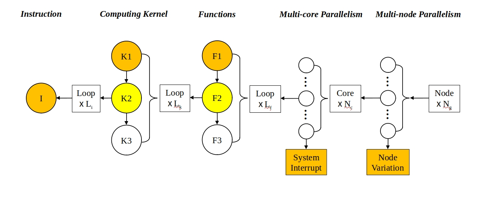

# Pfhsim

Pfhsim是一个大规模并行应用性能模拟器。可以通过配置文件来进行不同规模，不同扰动的并行应用性能模拟。

###### 模型：



对于绝大多数并行应用而言，普遍遵循着上图所示的模型运行。在$N_g$个节点上，每个节点占满$N_c$个核心，每个核心计算着相同循环次数$L_f$的相同运算过程，循环中运行的函数又可以分成三种，橙色表示自身有一定波动，黄色表示受到计算核心影响的函数，白色表示没有波动的函数。而计算核心常常也包含三种，橙色表示自身有波动，黄色表示受到有波动的指令影响的核心，白色表示没有波动的计算核心。

### 1 使用方法

#### 1.1 编译

**依赖：**openmpi、openblas、gsl

**编译步骤：**cd pfhsim && make

#### 1.2 运行

```shell
mpirun -n <processes> ./pfhsim <your_config_file> 
```

#### 1.3 配置文件使用方法

|      参数      |                             含义                             |
| :------------: | :----------------------------------------------------------: |
|     numRun     |                         模拟运行次数                         |
|    nodeNum     |                         模拟节点数目                         |
|   nodeNoise    |                      不同节点的性能噪声                      |
|   noisetype    | 噪声的概率分布（normal：正态分布，pareto：帕累托分布，os：操作系统噪声） |
| noiseParameter |                        概率分布的参数                        |
|    coreNum     |                         节点的核心数                         |
|    loopNum     |                         函数循环次数                         |
|    runTime     |                    无噪声时的标准运行时间                    |
| kernelLoopNum  |                       计算核心循环次数                       |
| instructionNum |                           指令数目                           |

通过改变pfhsim目录下的example.json文件中的参数来模拟不同规模，不同波动的并行应用。
